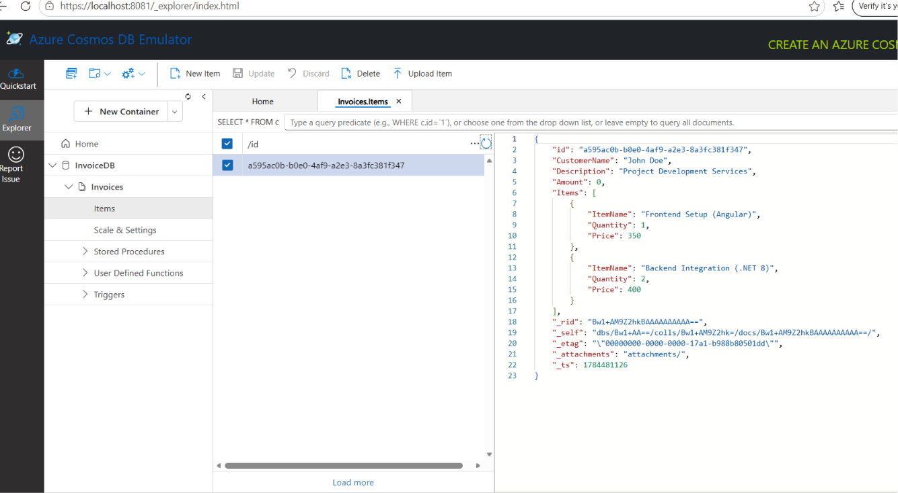

# Azure Serverless Full-Stack Invoice Processing System (.NET 8 & Angular v22)

A lightweight full-stack personal project that demonstrates dynamic invoice creation, serverless API development, NoSQL data persistence, and automated PDF generation.

Built with .NET 8 Azure Functions (Isolated Worker Model) for the backend and Angular v22 for the frontend, following Clean Architecture principles.

## Key Features

* **Modern Angular Frontend:** Built with Angular 22 using reactive forms, dynamic `FormArray` components, custom SCSS styling, and real-time input validation for dynamic invoice line items.

* **Serverless Architecture:** Utilises Azure Functions v4 with the .NET 8 Isolated Worker Model, providing scalable serverless execution with a clean separation between application logic and the Azure Functions runtime.

* **NoSQL Database Persistence:** Uses Azure Cosmos DB for scalable, schema-flexible storage of invoice records.

* **Dynamic Document Generation:** Converts structured JSON invoice payloads into downloadable PDF documents through server-side rendering.

* **Parallel Full-Stack CI Pipeline:** Uses GitHub Actions (`CI - Full Stack Azure Function .NET 8 & Angular Build & Test`) to automatically restore dependencies, build, and validate both the Angular frontend and .NET backend on every push.

* **Automated Testing:** Includes xUnit and Moq unit tests to validate business logic, repository behaviour, and maintain code quality throughout development.

---

## Tech Stack & Architecture

* **Backend Framework:** .NET 8.0 Azure Functions (Isolated Worker Model)
* **Frontend Framework:** Angular 22 (Reactive Forms, SCSS)
* **Database:** Azure Cosmos DB (NoSQL)
* **Document Generation:** IronPDF
* **Architecture:** Clean Architecture, Dependency Injection, Repository Pattern
* **Testing:** xUnit, Moq
* **CI/CD:** GitHub Actions

---

## Project Layout

```text
├── .github/workflows/              # Automated CI Build & Test Pipelines
├── invoice-generator/              # Angular 22 Frontend Application
├── InvoiceBackend/                 # .NET 8 Azure Functions Application
│   ├── assets/                     # Documentation Images & Screenshots
│   │   └── emulator-setup.png      # Cosmos DB Emulator Screenshot
│   ├── GenerateInvoice.cs          # HTTP Trigger API Endpoint
│   ├── IInvoiceRepository.cs       # Repository Abstraction
│   ├── InvoiceRepository.cs        # Cosmos DB Repository Implementation
│   ├── IInvoiceService.cs          # Business Logic Abstraction
│   ├── InvoiceService.cs           # Invoice Processing & PDF Generation
│   ├── InvoiceModel.cs             # Invoice Data Model / DTO
│   ├── Program.cs                  # Dependency Injection Configuration
│   └── host.json                   # Azure Functions Configuration
└── InvoiceBackend.Tests/           # Automated Unit Testing Suite
```

## Local Configuration

To run the project locally, create a `local.settings.json` file inside the Azure Functions project directory.

This file is excluded through `.gitignore` to prevent sensitive configuration values from being committed.

```json
{
  "IsEncrypted": false,
  "Values": {
    "AzureWebJobsStorage": "UseDevelopmentStorage=true",
    "FUNCTIONS_WORKER_RUNTIME": "dotnet-isolated",
    "CosmosDBConnectionString": "AccountEndpoint=https://your-local-or-live-cosmos;"
  }
}
```

### **Database Verification & Testing**
For zero-cost local development and rapid integration testing, this project uses the Azure Cosmos DB Emulator. Data structural validation is performed inside a container matching the following layout:
-Database ID: InvoiceDB
-Container ID: Invoices
-Partition Key: /id

When an execution request hits the API endpoint, the application automatically handles structural serialisation and maps incoming records smoothly directly into the local collection database documents.


### Integration Testing & CI/CD Security
This project includes a dedicated integration testing suite (`InvoiceBackend.IntegrationTests`) designed to verify real-world connectivity and data persistence with Azure Cosmos DB. 

**Running Tests Locally:**
When running locally, the integration tests connect seamlessly to the Azure Cosmos DB Emulator. Ensure the emulator is running before executing `dotnet test`.

**CI/CD Pipeline Considerations:**
To protect sensitive cloud credentials, the GitHub Actions pipeline (`azure-functions-deploy.yml`) is engineered to dynamically inject the database connection string at runtime:
* **Unit Tests (Quality Gate 1):** Run automatically on every push, requiring no database connection.
* **Integration Tests (Quality Gate 2):** Require a valid Cosmos DB connection string stored in GitHub Secrets (`COSMOS_DB_TEST_CONNECTION`). The pipeline uses a secure Linux `echo` command to build a temporary `appsettings.json` file, runs the tests against a live cloud test-database, and then completely destroys the virtual environment to prevent secret leakage.

## API Contract (POST)

### Endpoint

```http
POST /api/invoice/generate
```

### Headers

```http
Content-Type: application/json
```

### Request Body

```json
{
  "CustomerName": "John Doe",
  "Description": "Project Development Services",
  "Amount": 1150.00,
  "Items": [
    {
      "ItemName": "Frontend Setup (Angular)",
      "Quantity": 1,
      "Price": 350.00
    },
    {
      "ItemName": "Backend Integration (.NET 8)",
      "Quantity": 1,
      "Price": 400.00
    }
  ]
}
```

### **Response
Success (200 OK): Returns a raw binary file streaming response (application/pdf) prompting a direct download named Invoice_John_Doe.pdf.
Validation Failure (400 Bad Request): Returns a descriptive validation error string if required data payloads contain structural anomalies or missing attributes.
